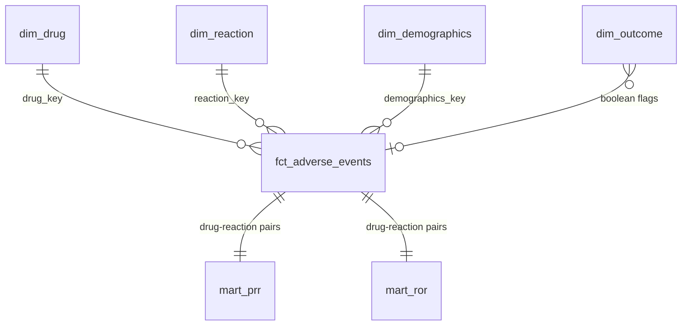
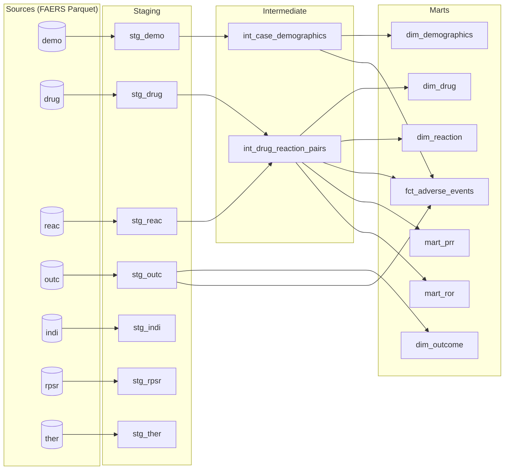

# Star Schema dbt Docs

This star schema has a fact table (cases with drug + reaction pairs), dimension tables for drug, reaction, outcome(s), and demographics. Additionally, PRR and ROR tables are calculated off of these drug-reaction pairs.

## Mermaid ER

## Mermaid DAG

## Design rationale
1. **Why (case, drug, reaction) fact grain instead of just case?** Case-level grain would force the user to perform the same action this dbt pipeline constructs in order to find relationships between drug and reaction. This triple isolates each drug-reaction pair for direct use by both the PRR and ROR tables.
2. **Why outcomes as boolean flags instead of a FK or bridge table?** Outcomes are many to many. For example, the same case may result in hospitalization and death. So, a foreign key could not match directly to a single outcome row. While a bridge table is a valid move, it introduces complexity and an additional table for maintenance and running. Boolean flags in the fact table keep the grain clean and let analysts simply query "where has_death = 1".
3. **Why dim_drug keyed on just drugname and not route?** Route is a very messy column. Sometimes null, other times many different words for the same thing. "Orally," "swallowed," "mouth," "ingested." It is simply not worth the time attempting to group by when drugname does the trick already.
4. **Why int models as ephemeral?** Ephemerals do not cost storage or overhead. They act as reusable SQL blocks, perfect for queries that don't need exposure.
5. **Why filter by PS (primary suspect) in the intermediate model?** This is pharmacovigilance convention. PRR and ROR are only used with primary suspect drugs. Including concomitant drugs would inflate denominators and dilute real signal.
6. **Why source signal marts from intermediates and not fact?** The intermediate models already have the exact grain needed for PRR/ROR calculation without the clutter of dimension keys and outcome flags. Additionally, ephemeral models, acting as SQL blocks, are free to use, acting as prepended CTEs to the file's query.
