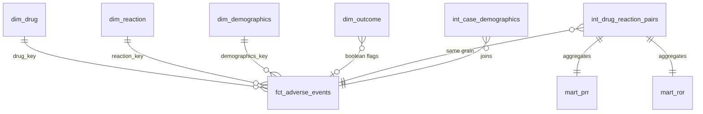

## Star-Schema dbt Docs

```mermaid
erDiagram
    dim_drug ||--o{ fct_adverse_events : "drug_key"
    dim_reaction ||--o{ fct_adverse_events : "reaction_key"
    dim_demographics ||--o{ fct_adverse_events : "demographics_key"
    dim_outcome }o--o| fct_adverse_events : "boolean flags"
    int_drug_reaction_pairs ||--|| mart_prr : "aggregates"
    int_drug_reaction_pairs ||--|| mart_ror : "aggregates"
    int_drug_reaction_pairs }o--|| fct_adverse_events : "same grain"
    int_case_demographics }o--|| fct_adverse_events : "joins"
```

