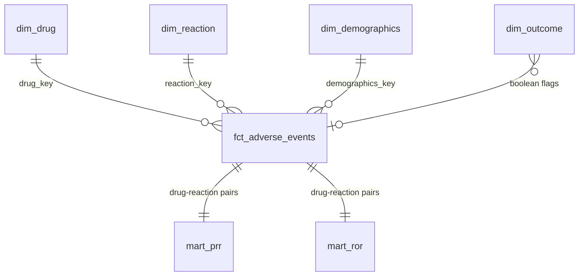
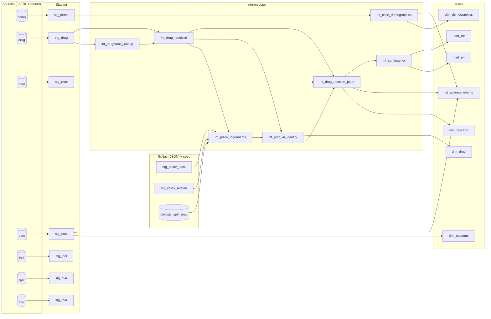

# Star Schema dbt Docs

This star schema has a fact table (cases with drug + reaction pairs), dimension tables for drug, reaction, outcome(s), and demographics. Additionally, PRR and ROR tables are calculated off of these drug-reaction pairs.

## Mermaid ER

```mermaid
erDiagram
    dim_drug ||--o{ fct_adverse_events : "drug_key"
    dim_reaction ||--o{ fct_adverse_events : "reaction_key"
    dim_demographics ||--o{ fct_adverse_events : "demographics_key"
    dim_outcome }o--o| fct_adverse_events : "boolean flags"
    fct_adverse_events ||--|| mart_prr : "drug-reaction pairs"
    fct_adverse_events ||--|| mart_ror : "drug-reaction pairs"
```

## Mermaid DAG

```mermaid
flowchart LR
    subgraph sources["Sources (FAERS Parquet)"]
        demo[(demo)]
        drug[(drug)]
        reac[(reac)]
        outc[(outc)]
        indi[(indi)]
        rpsr[(rpsr)]
        ther[(ther)]
    end

    subgraph staging["Staging"]
        stg_demo[stg_demo]
        stg_drug[stg_drug]
        stg_reac[stg_reac]
        stg_outc[stg_outc]
        stg_indi[stg_indi]
        stg_rpsr[stg_rpsr]
        stg_ther[stg_ther]
    end

    subgraph rxnav["RxNav (JSON) + seed"]
        stg_rxcui[stg_rxnav_rxcui]
        stg_related[stg_rxnav_related]
        seed_map[(biologic_split_map)]
    end

    subgraph intermediate["Intermediate"]
        int_lookup[int_drugname_lookup]
        int_resolved[int_drug_resolved]
        int_pieces[int_piece_ingredients]
        int_identity[int_prod_ai_identity]
        int_pairs[int_drug_reaction_pairs]
        int_cont[int_contingency]
        int_demo[int_case_demographics]
    end

    subgraph marts["Marts"]
        dim_drug[dim_drug]
        dim_reaction[dim_reaction]
        dim_outcome[dim_outcome]
        dim_demographics[dim_demographics]
        fct[fct_adverse_events]
        prr[mart_prr]
        ror[mart_ror]
    end

    demo --> stg_demo
    drug --> stg_drug
    reac --> stg_reac
    outc --> stg_outc
    indi --> stg_indi
    rpsr --> stg_rpsr
    ther --> stg_ther

    stg_drug --> int_lookup
    stg_drug --> int_resolved
    int_lookup --> int_resolved
    int_resolved --> int_pieces
    stg_rxcui --> int_pieces
    stg_related --> int_pieces
    seed_map --> int_pieces
    int_resolved --> int_identity
    int_pieces --> int_identity

    int_resolved --> int_pairs
    int_identity --> int_pairs
    stg_reac --> int_pairs
    stg_demo --> int_demo

    int_identity --> dim_drug
    int_pairs --> dim_reaction
    int_pairs --> fct
    int_pairs --> int_cont
    int_cont --> prr
    int_cont --> ror
    int_demo --> dim_demographics
    int_demo --> fct
    stg_outc --> dim_outcome
    stg_outc --> fct
```

## Design rationale
1. **Why (case, drug, reaction) fact grain instead of just case?** Case-level grain would force the user to perform the same action this dbt pipeline constructs in order to find relationships between drug and reaction. This triple isolates each drug-reaction pair for direct use by both the PRR and ROR tables.
2. **Why outcomes as boolean flags instead of a FK or bridge table?** Outcomes are many to many. For example, the same case may result in hospitalization and death. So, a foreign key could not match directly to a single outcome row. While a bridge table is a valid move, it introduces complexity and an additional table for maintenance and running. Boolean flags in the fact table keep the grain clean and let analysts simply query "where has_death = 1".
3. **Why dim_drug keyed on identity_key instead of drugname?** A drugname is a spelling, not a drug: Vicodin, Norco and "HYDROCODONE/ACETAMINOPHEN" were 390 separate drugnames splitting one drug's cases. identity_key is the sorted set of RxNorm ingredient identities for a prod_ai string (`int_prod_ai_identity`), so brands, generics, salt forms and ingredient order collapse to one drug (139,460 PS drugnames → 11,954 drugs). The label shown is the most-reported prod_ai string for that key. PS rows with no identity (no prod_ai, ambiguous `OR` strings, non-specific placeholders; ~2%) stay in the PRR/ROR background (c, d, N) but get no drug_key. Route is not part of the key or the fact table: it is messy (null, or "orally", "swallowed", "mouth" for the same thing) and nothing in the MVP uses it.
4. **Why int models as ephemeral?** Ephemerals do not cost storage or overhead. They act as reusable SQL blocks, perfect for queries that don't need exposure. Exception: models read by more than one downstream model (`int_drug_reaction_pairs`, `int_contingency`, the identity models) are tables, because an ephemeral is recomputed inside every model that uses it.
5. **Why filter by PS (primary suspect) in the intermediate model?** This is pharmacovigilance convention. PRR and ROR are only used with primary suspect drugs. Including concomitant drugs would inflate denominators and dilute real signal.
6. **Why source signal marts from intermediates and not fact?** The intermediate models already have the exact grain needed for PRR/ROR calculation without the clutter of dimension keys and outcome flags. `int_contingency` computes a/b/c/d once and both marts read it.
